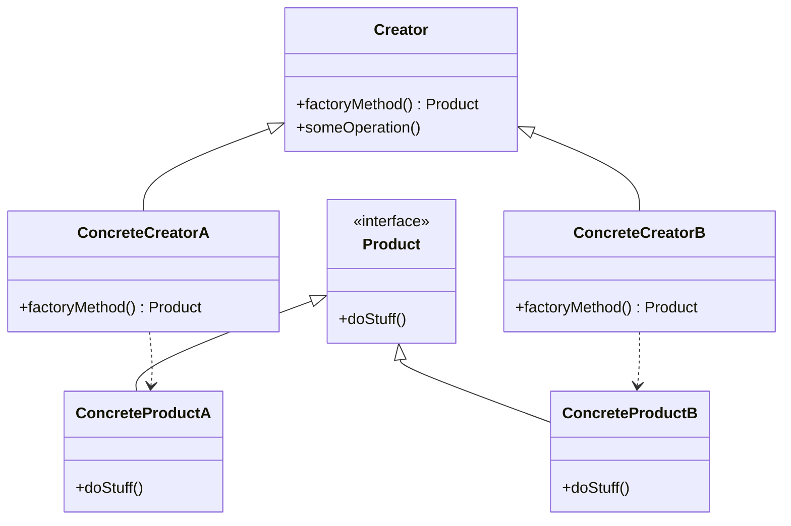
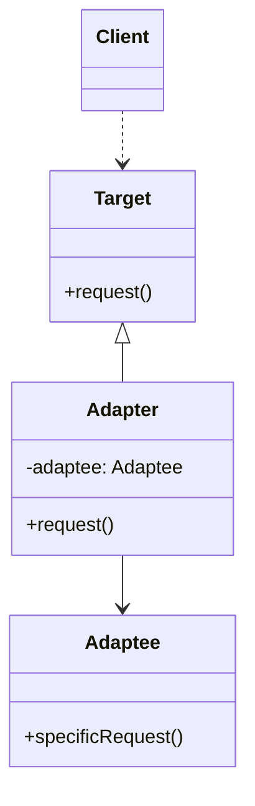
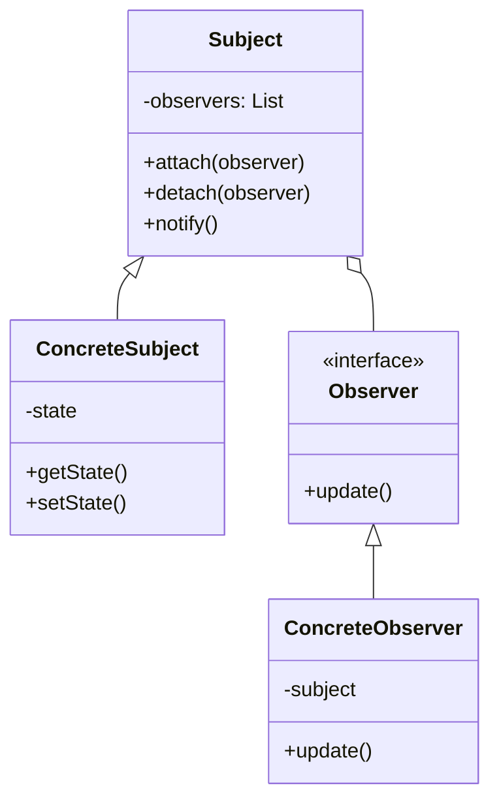

# Implementação de Padrões de Projeto

Este repositório contém exemplos de implementação de três padrões de projeto clássicos: **Factory Method** (Criacional), **Adapter** (Estrutural) e **Observer** (Comportamental).

Os exemplos foram baseados no catálogo do [Refactoring Guru](https://refactoring.guru/pt-br/design-patterns).

---

## 1. Padrão Criacional: Factory Method

### Problema
Imagine que você está criando uma aplicação de gestão de logística. A primeira versão da sua aplicação só pode lidar com transporte por caminhões, então a maior parte do seu código fica dentro da classe `Caminhao`. Depois de um tempo, sua aplicação se torna bastante popular. Cada dia você recebe dezenas de solicitações de empresas de transporte marítimo para que incorporem a logística do mar na aplicação.

Porém, o código é acoplado. Adicionar navios exigiria alterações em todo o código base.

### Solução
O padrão Factory Method sugere que você substitua as chamadas diretas de construção de objetos (usando o operador `new` ou init) por chamadas para um método *factory* especial. Os objetos ainda são criados via operador `new`, mas isso está sendo chamado de dentro do método *factory*.

### Diagrama UML (Conceitual)

### Explicação do Código (`factory_method/main.py`)
No exemplo implementado:
- `Logistica` é a classe Criadora (Creator) que declara o método fábrica `criar_transporte`.
- `LogisticaViaria` e `LogisticaMaritima` são criadores concretos que retornam `Caminhao` e `Navio`, respectivamente.
- O cliente (`planejar_entrega`) trabalha com a interface `Transporte`, sem saber se está usando um caminhão ou um navio.

---

## 2. Padrão Estrutural: Adapter

### Problema
Imagine que você está criando uma aplicação de monitoramento do mercado de ações. A aplicação baixa os dados da bolsa de XML para exibir gráficos. Em algum momento, você decide melhorar a aplicação integrando uma biblioteca de análise inteligente de terceiros. Mas há uma pegadinha: a biblioteca de análise só trabalha com dados em formato JSON.

### Solução
Você pode criar um *adaptador*. É um objeto especial que converte a interface de um objeto para que outro objeto possa entendê-lo. Um adaptador encobre um dos objetos para esconder a complexidade da conversão acontecendo nos bastidores.

### Diagrama UML (Conceitual)

### Explicação do Código (`adapter/main.py`)
No exemplo implementado:
- `SistemaPagamentoNovo` é o **Target** (o que o cliente espera usar).
- `SistemaPagamentoAntigo` é o **Adaptee** (o sistema legado incompatível).
- `AdaptadorPagamento` faz a ponte, recebendo a chamada `processar_pagamento` e convertendo para `realizar_cobranca_especifica` do sistema antigo.

---

## 3. Padrão Comportamental: Observer

### Problema
Imagine que você tem dois tipos de objetos: um objeto `Cliente` e um objeto `Loja`. O cliente está muito interessado em uma marca particular de produto (digamos, um novo modelo de iPhone) que deve ficar disponível na loja em breve.

O cliente pode visitar a loja todos os dias para checar a disponibilidade do produto. Mas enquanto o produto ainda está a caminho, a maioria dessas viagens será em vão.

### Solução
O padrão sugere que você adicione um mecanismo de assinatura para a classe notificar objetos individuais sobre quaisquer eventos que aconteçam com o objeto que eles estão observando.

### Diagrama UML (Conceitual)

### Explicação do Código (`observer/main.py`)
No exemplo implementado:
- `Newsletter` atua como o **Subject** (sujeito).
- `Leitor` é o **Observer** (observador).
- Quando a `TechNewsletter` (Concrete Subject) recebe uma `nova_noticia`, ela itera sobre sua lista de assinantes e chama o método `atualizar` de cada um, notificando-os automaticamente.

---

## Referências
- [Refactoring Guru - Design Patterns](https://refactoring.guru/pt-br/design-patterns)
